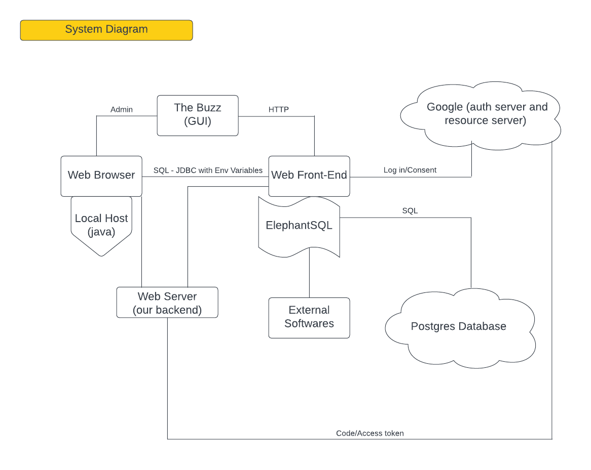
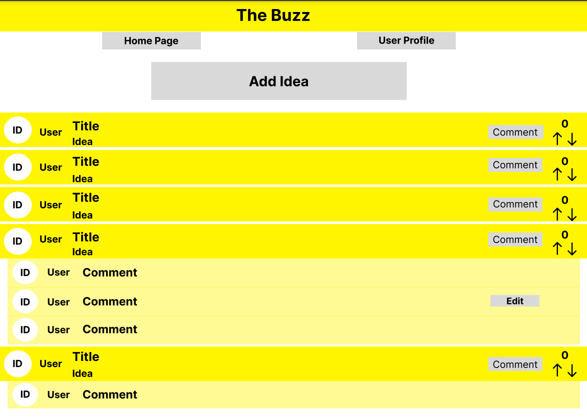
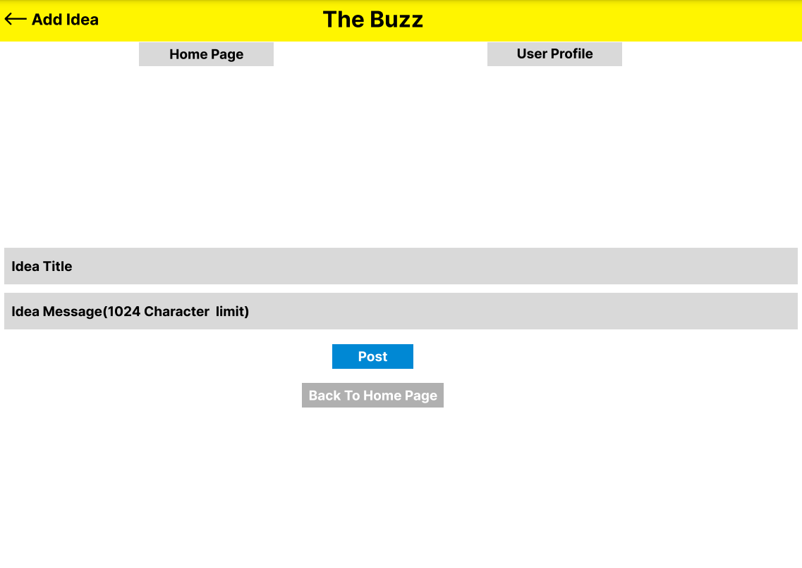
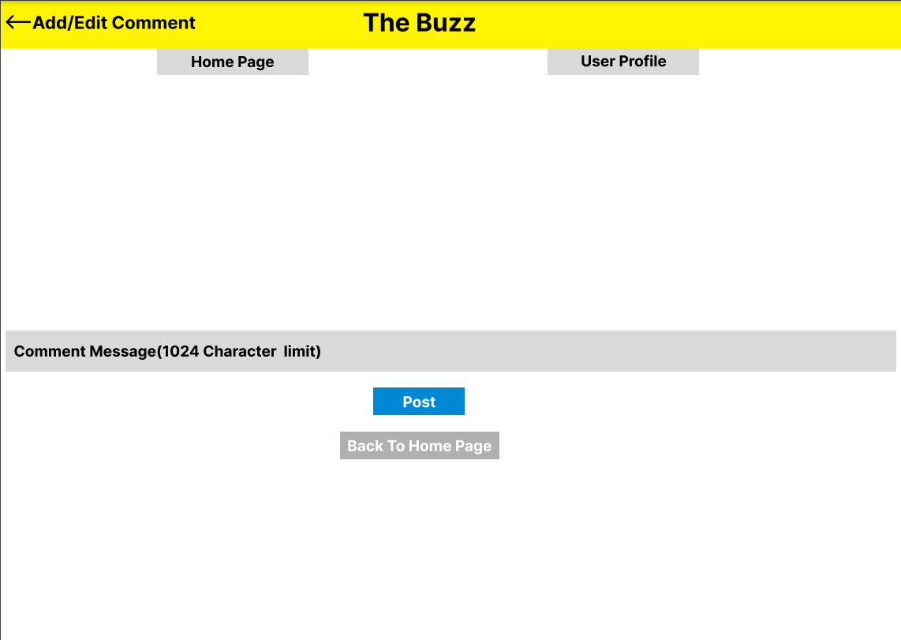
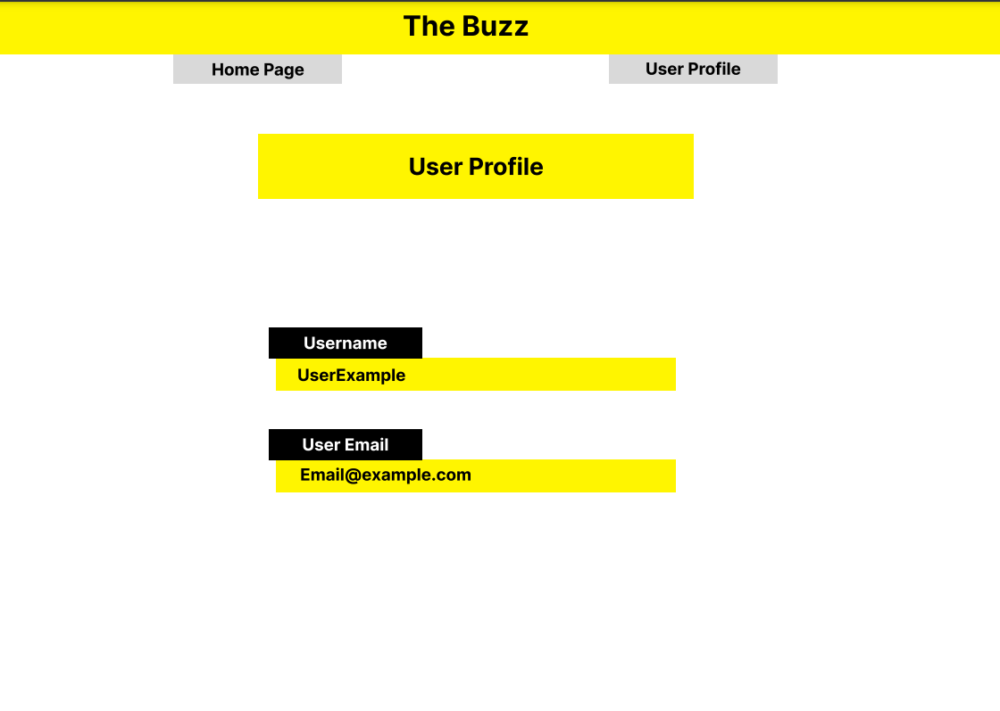
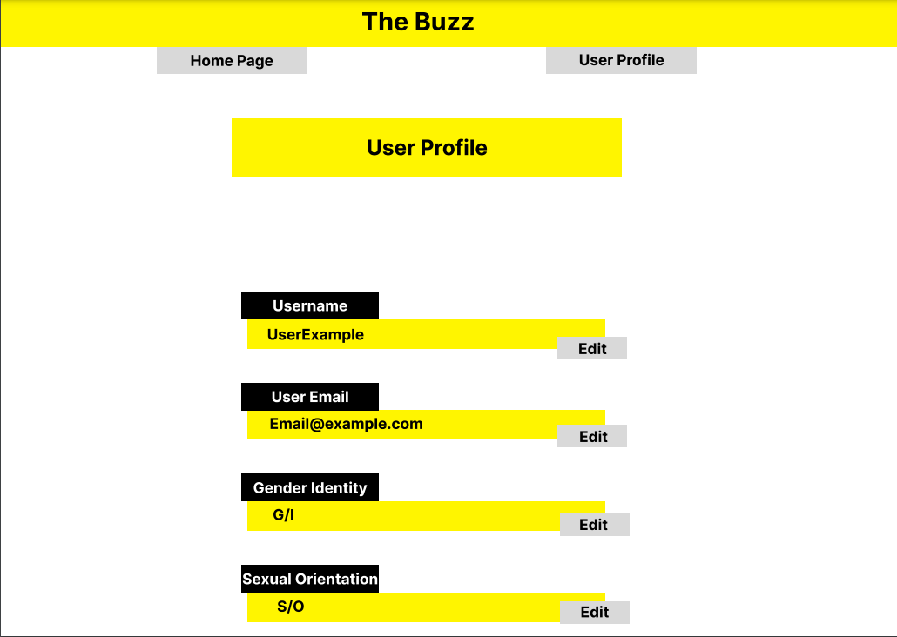
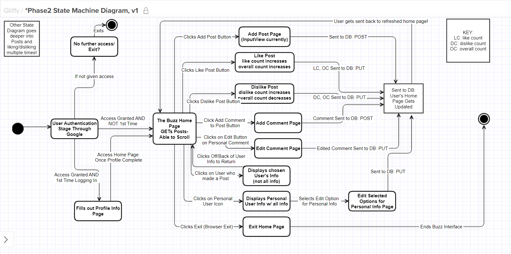
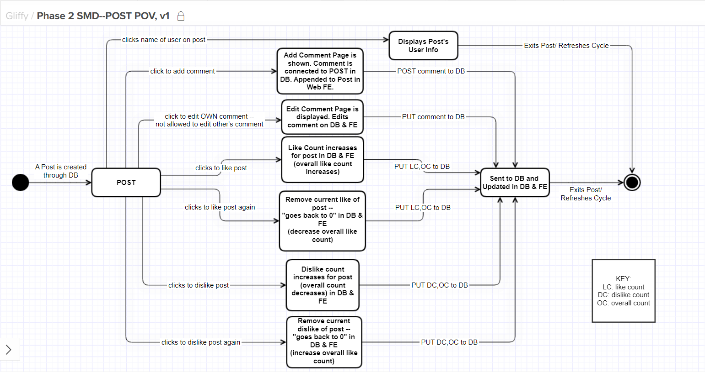
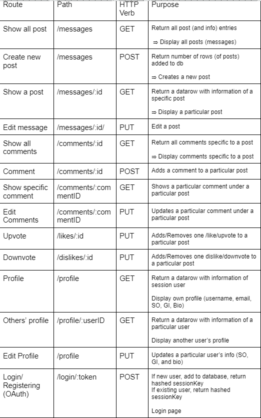
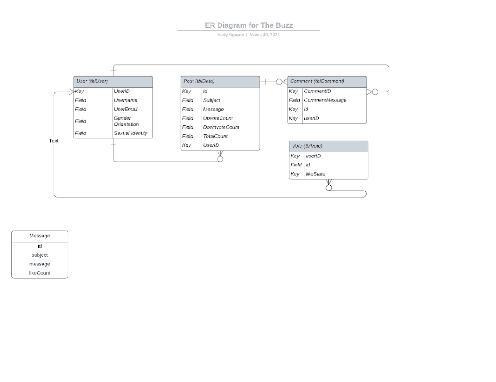

# README.md for Phase 2

## Updated User Stories for the Admin and Authenticated User

### **Admin User Stories**  
### User Story 1
1. As an **admin user**
2. I want to **be able to delete certain messages**
3. So I can **ensure that the messages on the platform are appropriate**

### User Story 2
1. As an **admin user**
2. I want to **see messages, add a message,  like messages, and dislike messages**
3. So I can **use the platform the way other users are**

### User Story 3
1. As an **admin user**
2. I want to **be able to remove users from the application*
3. So I can  **ensure that the content on the platform is appropriate**

### User Story 4
1. As an **admin user**
2. I want to **be able to log into the application*
3. So I can  *use the platform the way other users are**

### User Story 5
1. As an **admin user**
2. I want to **be able to fill out my user information for an account*
3. So I can  *use the platform the way other users are**

### **Authenticated User User Stories** 
### User Story 1
1. As a **user/employee (web visitor)**
2. I want to **login or create an account for "The Buzz"**
3. This way I can **communicate my own ideas that will be attached to my user and grant me acceses to "The Buzz"**  

### User Story 2
1. As a **user/employee (web visitor)**
2. I want to **Create a profile page upon creating my account**
3. This way I can **have other usres see my username and email while also providing my information to the system**  

### User Story 3
1. As a **user/employee (web visitor)**
2. I want to **be able to navigate to the home page or my profile page from the navigation bar**
3. This way I can **access the home page or my profile from anywhere on the app**  
Test: Manual - A user can click on the "home page" or "user profile" buttons from the navigation bar to navigate to their respective pages.  

### User Story 4
1. As a **user/employee (web visitor)**
2. I want to **dislike a message that myself or another employee added to the app**
3. This way I can **let other employee's know that I disagree with their idea**  

### User Story 5
1. As a **user/employee (web visitor)**
2. I want to **comment on another employee's idea**
3. This way I can **thoroughly communicate with other employees my thoughts on their ideas**  

### User Story 6
1. As a **user/employee (web visitor)**
2. I want to **edit my comments left on other emplyees' ideas**
3. This way I can **correct any mistakes left on another employees' idea or change my thoughts on what I think about their idea**  

### User Story 7
1. As a **user/employee (web visitor)**
2. I want to **view all previously posted messages as well as their comments**
3. This way I can **access all ideas previously posted by others as well as their comments**  

### User Story 8
1. As a **user/employee (web visitor)**
2. I want to **click on an employee's user to view their profile**
3. This way I can **view the employee's user profile**  

## Updated User Story-Based Tests (manual vs. automated)  

### **Admin Updated Automated Tests**  
#### [Link to ALL Admin Tests in Bitbucket](https://bitbucket.org/cse216git/teamrepo/src/bbfc620a03008f20795426d7a8666b02eb934100/admin-cli/src/test/java/edu/lehigh/cse216/yen225/admin/AppTest.java)  
/*   
 Test for insertRow()  
 for adding a user to app   
*/  

public void  testRemoveRowUser (){  
  Map<String, String> env = System.getenv();  
  String ip = env.get("POSTGRES_IP");  
  String port = env.get("POSTGRES_PORT");  
  String user = env.get("POSTGRES_USER");  
  String pass = env.get("POSTGRES_PASS");  
  String tblName = "tblTest";  
  String username = "TestUser";  
  String email = "test225@lehigh.edu";  
  int genderID = 1 ;   
  int sexO = 2 ;   
  Database db = Database.getDatabase(ip, port, user, pass,tblName);  
  db.createTable();  
  db.insertRowUser(username, email, genderID, sexO);  
  int id= db.getID(username);  
  int count = db.deleteRow(id);  
  assertTrue(count==0);  
  db.dropTable();  
}    

/*  
  Test for createTable()  
  for the User Table  
*/  
public void testAddTableUser(){  
    Map<String, String> env = System.getenv();  
    String ip = env.get("POSTGRES_IP");  
    String port = env.get("POSTGRES_PORT");  
    String user = env.get("POSTGRES_USER");  
    String pass = env.get("POSTGRES_PASS");  
    String tblName = "tblTest";  
    Database db = Database.getDatabase(ip, port, user, pass,tblName);  
    db.createTable();  
    assertTrue( db.selectAll() != null);  
    db.dropTable();  
}  

/*  
 Test for deleteRow()  
*/  
public void testRemoveRow(){  
    Map<String, String> env = System.getenv();  
    String ip = env.get("POSTGRES_IP");  
    String port = env.get("POSTGRES_PORT");  
    String user = env.get("POSTGRES_USER");  
    String pass = env.get("POSTGRES_PASS");  
    String tblName = "tblTest";  
    String message = "Test Message";  
    String subject = "Test Subject";  
    Database db = Database.getDatabase(ip, port, user, pass,tblName);  
    db.createTable();  
    db.insertRow(subject, message);  
    int id= db.getID(message);  
    int count = db.deleteRow(id);  
    assertTrue(count==0);  
    db.dropTable();  
}  

public void testInsertRow(){  
    Map<String, String> env = System.getenv();  
    String ip = env.get("POSTGRES_IP");  
    String port = env.get("POSTGRES_PORT");  
    String user = env.get("POSTGRES_USER");  
    String pass = env.get("POSTGRES_PASS");  
    String tblName = "tblTest";  
    String message = "Test Message";  
    String subject = "Test Subject";  
    Database db = Database.getDatabase(ip, port, user, pass,tblName);  
    db.createTable();  
    int count = db.insertRow(subject, message);  
    assertEquals(count, 1);  
    db.dropTable();  
}  

### **Frontend Updated Manual Tests**   
### User Story Test 1
* Test: Manual - A web visitor can use their google account on the login page to login or create their account for "The Buzz"  

### User Story Test 2
* Test: Manual - A first time web visitor with no account will be taken to the account creation page where they can input their account information.  

### User Story Test 3
* Test: Manual - A user can click on the "home page" or "user profile" buttons from the navigation bar to navigate to their respective pages.  

### User Story Test 4
* Test: Manual - A user can cick on the downvote button to "dislike" a post and causing its "like" number to drop by 1.  

### User Story Test 5
* Test: Manual - A user can click the comment button and taken to a new page to create a comment for the post they chose to comment on.  

### User Story Test 6
* Test: Manual - A user can click on their own comments' edit button. This will take them to a different page where they can re-enter their comment.  

### User Story Test 7
* Test: Manual - A user can see all ideas, messages, and comments on the main page.  

### User Story Test 8
* Test: Manual - A user would click on another user's ID and be transported to that User's profile page.  

## System Drawing  

  

## Updated Mock Web UI Drawings  

## Updated state machine drawing for user persona’s interaction with the application  

  

## NEW state machine drawing from perspective of an idea object  

## Updated Listing of Routes, their Purpose, and Format of Passed Objects.  

## Updated Entity Relationship Diagram of the Database Tables and Fields.  

## Updated Unit Test DESCRIPTIONS for All Roles  
### **Backend Unit Test Descriptions**  
1. Test connection to database (use select all make sure not null)  
2. Add a message, get all (Select all), get the specific (select one), make sure return is not null  
3. Add a message, add comment on that message (post route for comment) – make sure not null, show that specific comment (get specific comment route), edit the comment (put route for comment), add another comment (post route for comment), show all comments specific to that post (get all route for comment)  
4. add a message, call insertlike method, show specific message and its like count (get specific post), call insertlike again, show again  
5. add a message, call insertdislike method, show specific message and its like count (get specific post), call insertdislike again, show again  
6. manual postman test for login, pass in a valid access token in Authorization header, check response  

### **Admin Unit Test Descriptions**
1. Test for insertRow() for regular posts
2. Test for deleteRow()
3. Test for createTable() for the User Table
4. Test for insertRow() for adding a user to app
5. Test for removeRow() for removing a user from app
6. Ensure that the constructor populates every field of the object it creates

### **Frontend Test Descriptions**   
1. Test if a web visitor can use their google account on the login page to login or create their account for "The Buzz"  
1. Test if a  first time web visitor with no account will be taken to the account creation page where they can input their account information.  
1. Test if a user can click on the "home page" or "user profile" buttons from the navigation bar to navigate to their respective pages.  
1. Test if a  user can cick on the downvote button to "dislike" a post and causing its "like" number to drop by 1.  
1. Test if a  user can click the comment button and taken to a new page to create a comment for the post they chose to comment on.  
1. Test if a  user can click on their own comments' edit button. This will take them to a different page where they can re-enter their comment.  
1. Test if a user can see all ideas, messages, and comments on the main page.  
1. Test if a user would click on another user's ID and be transported to that User's profile page.

## Backlog Items and Tech Debt  

1. The only current back log items that we believe we have is having dokku host our frontend, as have our web front end interface display when visiting the [dokku app link](http://2023sp-phase1-6.dokku.cse.lehigh.edu), which it currently does not display, but /messages and /message/:id works correctly by displaying the messages in json format.