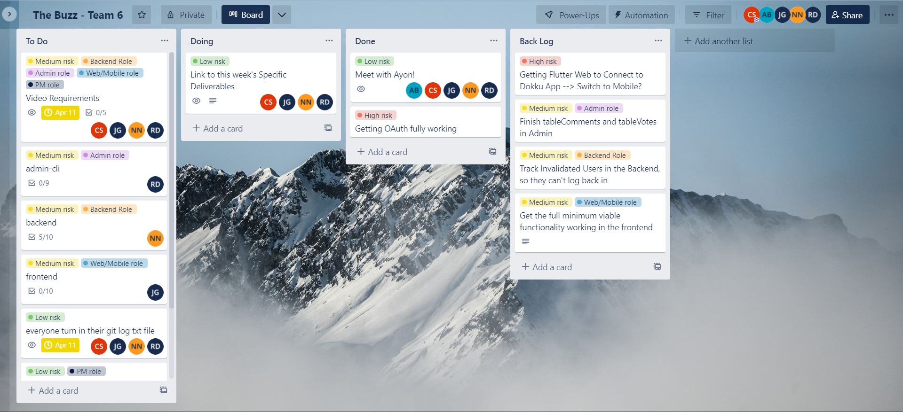

# Phase 2 Sprint 9 - PM Report
Use this form to provide your project manager report for Phase 2 Sprint 9.  Please give detailed answers.
In addition to uploading to coursesite, version control this in the `master` branch under the `docs` folder.

## Team Information [25 points]

Team Information:  
* Number: 6  
* Name: Sixware Engineers  
* Mentor: <Ayon Bhowmick, ayb224@lehigh.edu>  

Team Roles:  
* Project Manger: <Carson Stotler, crs225@lehigh.edu>  
* Backend developer: <Nelly Nguyen, yen225@lehigh.edu>  
* Admin developer: <Riley Dembo, rmd225@lehigh.edu>  
* Flutter developer: <Jesus Gutierrez, jeg325@lehigh.edu>  

Essential links for this project:  
* Team's Dokku URL(s) (live web front-end link)  
    * http://2023sp-phase1-team6.dokku.cse.lehigh.edu  
* Team's software repo (bitbucket)  
    * https://bitbucket.org/cse216git/teamrepo/src/master/ 
* Team's Trello board  
    * https://trello.com/invite/b/k6TDKKw5/ATTI58c7c8d8a99e2e8fc512cb422fdaf28fD008A87F/the-buzz-team-6  

Screenshot of Trello board:  
(should match/support list of backlog and tech debt items in subheadings below)
 

## Role reporting [75 points total, 15 points each (teams of 4 get 15 free points)]
Report-out on each role, from the PM perspective.
You may seek input where appropriate, but this is primarily a PM related activity.

### Back-end

1. Describe the engagement of this component's developer with the team (How effective was the process? How was communication with the team - use of Slack and Trello, attendance and participation in meetings, etc. How were tasks created? How was completion of tasks verified?)
* The backend got a lot of her stuff done by the early part of the week but was unable to fully test it due to the frontend taking a little longer due to other time constraints. But the backend was helpful in reaching out and always communicating with the team on how she can help progress the team. She also was always present in class and meetings.
1. Assess the completeness of this component (list remaining backlog item(s), if any)
* I believe at this time, the backend is complete with all it routes and functionality. It has also been test very highly through postman and postgres.
1. List your back-end's REST API endpoints
* GET - get ideas (/messages or /messages/:id), comments (/comments or /comments/:commentID), or get profile (/profile or /profile/userID)  
* POST - post ideas (/message), comments (/comments/:commentsID) or post login (/login/:token)
* PUT - update comments(/comments/:commentID), vote count (/likes/:id or /dislikes/:id), or profile page (/profile)
1. Assess the quality of the back-end code
* The back-end code is high quality. The routes and organization is laid out organized with comments on what each route is expected to do.
1. Describe the code review process you employed for the back-end
* Once the backend did a pull request, I looked through their code to analyze and look for mistakes or errors, and as any came up I would talk to them to assess the situation and discuss the functionality and possible mishap that may have occurred.
1. What was the biggest issue that came up in code review of the back-end server?
* I don't think any big issues came up in the backend code review, just from my perspective getting thrown into the code and trying to understand everything was a small adjustment.
1. Is the back-end code appropriately organized into files / classes / packages?
* Yes it is appropriately organized into files, folders, and packages.
1. Are the dependencies in the pom.xml file appropriate? Were there any unexpected dependencies added to the program?
* The dependencies in the pom.xml file are seem appropriate and useful.  
1. Evaluate the quantity and quality of the unit tests for the back-end
* The back-end had a good amount of unit tests, some appear functional, while some are commented out at the moment, they may also be old unit tests that are not functional at the moment. They used postman a lot to test their code as well.
1. Describe any technical debt you see in the back-end, if any
* At the moment, they need to keep track of invalidated users to make sure they are not able to log back in to the app.

### Admin

1. Describe the engagement of this component's developer with the team (How effective was the process? How was communication with the team - use of Slack and Trello, attendance and participation in meetings, etc. How were tasks created? How was completion of tasks verified?)
* The admin developer did well incorporating their code early within the sprint and tested along the way as frontend was getting set up. They were very communicative with the team when problems arised, and attended all meetings and classes. They would show progress as the week went along to show how tasks were completed.  
1. Assess the completeness of this component (list remaining backlog item(s), if any)
* The code is fairly complete with most tables being worked on, but the admin focused on some tables more than others, and the next sprint will have to work on fixing and finishing those tables.
1. Describe the tables created by the admin app
* tableUser (to store all the users), tableData (for posts), tableComment (for all the comments), tableVote (for the like counts)
1. Assess the quality of the admin code  
* The quality of the admin code seems appropriate and solid and up to par with the previous phase's admin code.  
1. Describe the code review process you employed for the admin app
* Once the admin did a pull request, I looked through their code to analyze and look for mistakes or errors, and as any came up I would talk to them to assess the situation and discuss the functionality and possible mishap that may have occurred. Also through the code review, I just ensured everything was in the tables as needed.
1. What was the biggest issue that came up in code review of the admin app?
* Using git was the biggest issue in this code review and pull request, as git and pull conflicts arose and caused problems in this process.
1. Is the admin app code appropriately organized into files / classes / packages?
* The admin app code is appropriately organized into files, folder, and packages.  
1. Are the dependencies in the pom.xml file appropriate? Were there any unexpected dependencies added to the program?  
* All dependencies in the pom.xml file appear appropriate and useful to the functionality of the code. There are no unexpected dependencies that I can tell.
1. Evaluate the quantity and quality of the unit tests for the admin app
* The admin has a good quantity of unit tests, with some old or refining ones commented out. But the quality is good as they are work as expected.
1. Describe any technical debt you see in the admin app, if any
* The admin hasn't added rows into table comments and table vote yet, and focused on the other tables more, so will have to work on those in the next sprint. 

### Frontend/Flutter

1. Describe the engagement of this component's developer with the team (How effective was the process? How was communication with the team - use of Slack and Trello, attendance and participation in meetings, etc. How were tasks created? How was completion of tasks verified?)
* The frontend developer this week had exams so got started a little late, but slowly made progress but had trouble with OAuth this week. The teammate communicated well with the team to express their struggles and ask for help, which helped the team overall. They attended all the meetings and classes. And I believe they used Trello to update their progress and used Slack to communicate outside of class.  
1. Assess the completeness of this component (list remaining backlog item(s), if any)
* We got OAuth fully working!! Due to the large time that took up for our frontend, they were unable to fully get the rest of the functionality working, but they have a good plan and base set up to get the rest of the functions to work in the next sprint!
1. Describe the different models and other templates used to provide the web front-end's user interface
* We used flutter for the front-end's user interface, but for our mocks they used figma to draw up plans on the interface. For most content, they used ListTile to dipslay the information, which Flutter puts it in a formatted list of information.  
1. Assess the quality of the front-end code
* I believe the quality of the front-end's code is solid! Trouble occurred switching to flutter, but I think they have figured it out and building quality code. They said comments are something they want to focus on next sprint.
1. Describe the code review process you employed for the front-end
* Throughout the week we worked with the front-end, so I was able to see the code develop and the problems that were occurring. So through the review process I was able to recognize and understand the code, also because I was flutter front-end last phase. But we worked together to walk through the functionality thus far, to ensure its quality.
1. What was the biggest issue that came up in code review of the front-end?
* Within the code review, no big issues arose, big issues such as OAuth came up during the sprint, but not so much in the code review.
1. Is the front-end code appropriately organized into files / classes / packages?
* The front-end's code is appropriately organized into files and folders.  
1. Are the dependencies in the package.json file appropriate? Were there any unexpected dependencies added to the program?
* The dependencies in the package.json all seem appropriate and useful for the functionality of the code. I don't believe any of the dependencies are unexpected.  
1. Evaluate the quantity and quality of the unit tests for the Web front-end 
* At this moment, there aren't a ton of functional unit tests as they still need to change the routes so the session key gets sent within the route to the backend. But they have high quality manual unit tests for the simple functionality.
1. Describe any technical debt you see in the front-end, if any
* The current tech debt is fixing the routes to send the session key, once the routes are fixed, they will have to implement comments, individual users/user profiles, and correct the vote count methodology.

### Project Management
Self-evaluation of PM performance

1. When did your team meet with your mentor, and for how long?
* We met with Ayon on Friday morning at 11:35 for about 30-40 minutes.  
1. Describe your use of Trello.  Did you have too much detail?  Too little?  Just enough? Did you implement policies around its use (if so, what were they?)?
* I put general things for the week for the team, such as our shared video requirements, but also had cards describing specific roles deliverables for the week so they have a quick way to look at and check off their progress.  
1. How did you conduct team meetings?  How did your team interact outside of these meetings?
* I think as a team we conducted meetings very collaboratively by working through the problems we are having and what needs to be done. Outside of the meetings we would slack message updates to each other and to ask questions or help.
1. What techniques (daily check-ins/scrums, team programming, timelines, Trello use, group design exercises) did you use to mitigate risk?
* We used check-ins on slack over the week, Trello Use, and set timelines for when we want to have certain fuctionality complete.  
1. Describe any difficulties you faced in managing the interactions among your teammates? Were there any team issues that arose?
* I don't think I had any difficulties managing my interactions among my teammates, and no direct issues arose from that.  
1. How well did you estimate time during the early part of the phase?  How did your time estimates change as the phase progressed?
* I think the other roles, mostly Frontend, had exams in the beginning of the week which caused a time constraint on making progress this sprint, but time estimates became more heavy later in the sprint.
1. What aspects of the project would cause concern for your customer right now, if any?
* As of right now, their isn't any functionality on the app, besides being authenticated through Google, thus concerns of posting, commenting, liking, disliking, and having users would come up for our customer.
1. What is your biggest concern as you think ahead to the next phase of the project?
* Time constraint with this phase starting two days later is a concern as there is still a lot of work to do on the front-end side of the app. But with the big problems behind us, I hope the next function implementation will be easier and more straightforward.
1. Describe the most significant obstacle or difficulty your team faced.
* I think the biggest difficulty was getting OAuth up and running, progress was slowly made, but we as a team didn't fully understand the specifics with OAuth in Flutter.