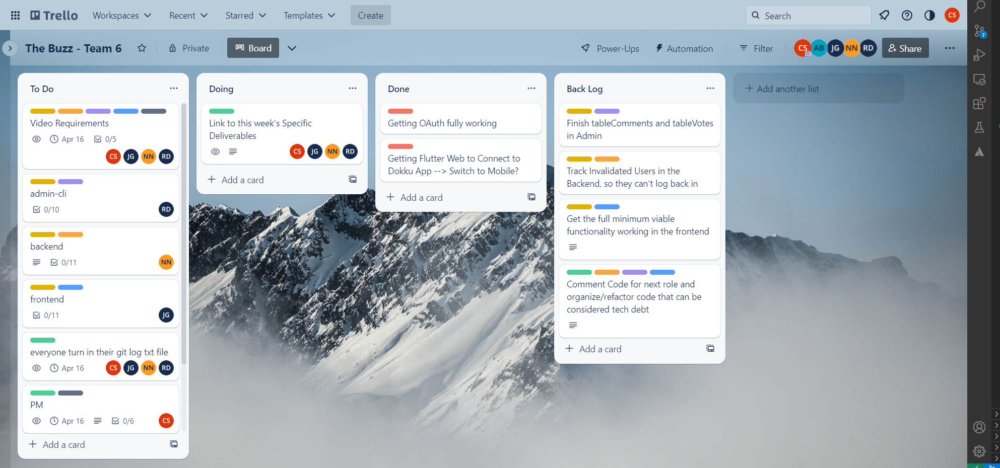
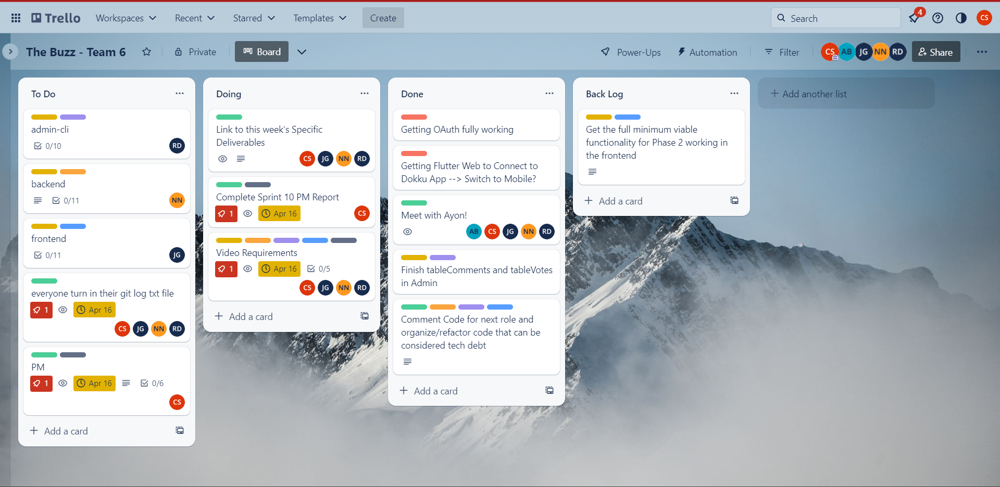

# Phase 2' Sprint 10 - PM Report
Use this form to provide your project manager report for Phase 2' (Prime).  Please give detailed answers.
In addition to uploading to coursesite, version control this in the `master` branch under the `docs` folder.

## Team Information [10 points]

Team Information:  
* Number: 6  
* Name: Sixware Engineers  
* Mentor: <Ayon Bhowmick, ayb224@lehigh.edu>  

Team Roles:  
* Project Manger: <Carson Stotler, crs225@lehigh.edu>  
* Backend developer: <Nelly Nguyen, yen225@lehigh.edu>  
* Admin developer: <Riley Dembo, rmd225@lehigh.edu>  
* Flutter developer: <Jesus Gutierrez, jeg325@lehigh.edu>  

Essential links for this project:  
* Team's Dokku URL(s) (live web front-end link)  
    * https://2023sp-phase1-team6.dokku.cse.lehigh.edu  
* Team's software repo (bitbucket)  
    * https://bitbucket.org/cse216git/teamrepo/src/master/ 
* Team's Trello board  
    * https://trello.com/invite/b/k6TDKKw5/ATTI58c7c8d8a99e2e8fc512cb422fdaf28fD008A87F/the-buzz-team-6 

## Beginning of Phase 2' [20 points]
Report out on the Phase 2 backlog and any technical debt accrued during Phase 2.

1. What required Phase 2 functionality was not implemented and why? 
    * This should be a list of items from the Phase 2 backlog that were not "checked off".
    * These high-priority items are to be added to the Phase 2' backlog that appears on your Trello board.
    * Finish tableComments and tableVotes in Admin after getting populated and being able to check for mistakes.
    * Track invalidated Users in the Backend, so they can't log back in.
    * Get the full minimum viable functionality working in the frontend, by implementing comments, user profiles, new vote count methodology, and other functionality.
1. What technical debt did the team accrue during Phase 2?
    * List this based on a unit-by-unit basis, as appropriate. It should summarize what appears in the role-reporting section, which may include further details.
    * These items are to be added to the Phase 2' backlog that appears on your Trello board.
    * I think overall, revising and refactoring code to make it easier to understand for the next person in that role, along with commenting functionality and purpose of specific functions is the tech debt from Phase 2.

Screenshot of Trello board (at the beginning of phase 2'):  
(should match/support list of backlog and tech debt items)

## End of Phase 2' [20 points]
Report out on the Phase 2' backlog.

1. What required Phase 2 functionality still has not been implemented or is not operating properly and why?
* Overall the comments are not fully functional, along with the like button being functional but is not getting the likecount at the moment (easy fix), and for some reason it won't scroll on the page, which makes testing a bit harder. Most of these functionalities became hard to finish due to the constraint OAuth and https brought onto the team the past two weeks.  
1. What technical debt remains?
* No real tech debt remains besides the backlog of the parts of the front-end that are still not functional for the minimum viable deliverables.

Screenshot of Trello board (at the close of phase 2'): 
(should match/support list of backlog and tech debt items) 

## Role reporting [50 points total, 10 points each (teams of 4 get 10 free points)]
Report-out on each team members' activity, from the PM perspective (you may seek input where appropriate, but this is primarily a PM related activity).

1. If there was any remaining Phase 2 functionality that needed to be implemented in Phase 2', what did the PM do to assist in the effort of getting this functionality implemented and operating properly?
* Most of the remaining functionality was a part of the front-end, so I tried to reach out and ask if I can help the front-end role in any way I can. I also checked on the backend and admin roles to ensure they were finishing up their final implementation parts for this phase.  

### Back-end

1. What did the back-end developer do during Phase 2'?
* The back-end's main concern for this phase was to work on tracking invalidated users so they are unable to log back into the app. Also they worked on commenting and preparing to switch roles.  
1. Describe the engagement of this component's developer with the team (How effective was the process? How was communication with the team - use of Slack and Trello, attendance and participation in meetings, etc. How were tasks created? How was completion of tasks verified?)
* The back-end was very engaged with the team this week, as they continued to participate in class and in meetings, as well as over Slack messages. They didn't have much to do this week, so they ensured that other roles had everything complete so the team's goals were accomplished.  
1. Assess the completeness of this component (list remaining backlog item(s), if any)
* I believe the completeness of this component is very full and complete. I think all components are finished and no backlog items remain for the back-end role.  
1. List your back-end's REST API endpoints
* GET - get ideas (/messages or /messages/:id), comments (/comments or /comments/:commentID), or get profile (/profile or /profile/userID)  
* POST - post ideas (/message), comments (/comments/:commentsID) or post login (/login/:token)
* PUT - update comments(/comments/:commentID), vote count (/likes/:id or /dislikes/:id), or profile page (/profile)  
1. Assess the quality of the back-end code
* Overall, I think the back-end has high quality code. The routes and database are well-written overall I believe.  
1. Describe the code review process you employed for the back-end
* The back-end was not able to fully able to track invalidated users this week, so there was nothing new from back-end to have a pull request and code review this week.
1. What was the biggest issue that came up in code review of the back-end server?
* No issues came up from the back-end.
1. Is the back-end code appropriately organized into files / classes / packages?
* Yes it is appropriately organized into files, folders, and packages.  
1. Are the dependencies in the pom.xml file appropriate? Were there any unexpected dependencies added to the program?
* The dependencies in the pom.xml file are seem appropriate and useful.  
1. Evaluate the quantity and quality of the unit tests for the back-end
* The quality and quantity of the unit tests for back-end are very good!
1. Describe any technical debt you see in the back-end, if any
* No tech debt based on the deliverables, we may want to track invalidated users as a team though at some point.

### Admin

1. What did the admin front-end developer do during Phase 2'?
* The main component that the admin needed to finish up was finishing up the final touches of the vote and comments table. Once they are populated with test cases, the admin will finalize those tables and ensure they are working properly.  
1. Describe the engagement of this component's developer with the team (How effective was the process? How was communication with the team - use of Slack and Trello, attendance and participation in meetings, etc. How were tasks created? How was completion of tasks verified?)
* The admin, like everyone, was engaged with the team this week in meetings and class discussions. They were also participative in the Slack and other outside of class communication.  
1. Assess the completeness of this component (list remaining backlog item(s), if any)
* I believe overall, the code was complete with all the tables complete and their functionalities working. 
1. Describe the tables created by the admin app
* tableUser (to store all the users), tableData (for posts), tableComment (for all the comments), tableVote (for the like counts)
1. Assess the quality of the admin code
* Overall, I think the admin code is of high quality and organized with easy readability. The tables are well put together will all necessary values.  
1. Describe the code review process you employed for the admin app
* The admin got all of their stuff complete last sprint. Their tables were complete and available for use, so no code review and pull request occurred.
1. What was the biggest issue that came up in code review of the admin app?
* No issues came up in the code review process for admin.
1. Is the admin app code appropriately organized into files / classes / packages?
* I believe the admin app is organized appropriately into files, folders, and classes.   
1. Are the dependencies in the pom.xml file appropriate? Were there any unexpected dependencies added to the program?
* All dependencies in the pom.xml file appear appropriate and useful to the functionality of the code. There are no unexpected dependencies that I can tell.  
1. Evaluate the quantity and quality of the unit tests for the admin app
* The admin has a good quantity and quality of unit tests!
1. Describe any technical debt you see in the admin app, if any
* Admin does not have any tech debt that we know of from the deliverables.

### Front-end Flutter  

1. What did the front-end developer do during Phase 2'?
* Phase 2, sprint 9, was tough getting OAuth fully working, so we were not able to implement comments, different users and their pages, votes, and other functionality through thoses. So, those are what the front-end is focusing on for Phase 2'.
1. Describe the engagement of this component's developer with the team (How effective was the process? How was communication with the team - use of Slack and Trello, attendance and participation in meetings, etc. How were tasks created? How was completion of tasks verified?)
* The front-end developer was very engaged in classroom and meeting conversations. They communicated outside of class as well, with updating the team on their progress with their tasks.  
1. Assess the completeness of this component (list remaining backlog item(s), if any)
* The front-end is not totally complete, as troubles came up for comments, as that is the main issue that was not fully implemented this week.
* Backlog would include: getting comments to work in total, scrolling is not working properly, and other small mishaps in other functionalities.
1. Describe the activities that comprise the front-end app
* The front-end app is comprised of being able authenticated to log in to the app, once in- you can create a profile for yourself, you can edit it if you desire, you can add posts, you can comment on posts, you can edit your own comments, you can like and dislike posts, and you can view other people's profiles.  
1. Assess the quality of the front-end code
* The front-end code is of high quality, may not be complete to the deliverables quite yet, but the code is good!
1. Describe the code review process you employed for the front-end
* We did a code review during our meeeting at the end of the week before making our video. It went smoothly and we discussed any mishap and functionalities still missing on the front-end.
1. What was the biggest issue that came up in code review of the front-end?
* No real issues came up during the code review, mostly just had to talk through missing functionality and what still needs to be done next phase.
1. Is the front-end code appropriately organized into files / classes / packages?
* The front-end's code is appropriately organized into files and folders.
1. Are the dependencies in the pubspec.yaml (or build.gradle) file appropriate? Were there any unexpected dependencies added to the program?
* The dependencies in the package.json all seem appropriate and useful for the functionality of the code. I don't believe any of the dependencies are unexpected.
1. Evaluate the quantity and quality of the unit tests for the Mobile front-end here
* The quantity of automatic unit tests are limited due to the confusion of flutter unit tests, but has lots of manual tests to test routes and button functionality.
1. Describe any technical debt you see in the Mobile front-end, if any
* No tech-debt, besides still need to comment the code. Just the backlog already mentioned.

### Project Management
Self-evaluation of PM performance

1. When did your team meet with your mentor, and for how long?
* We met with Ayon this week on Sunday at 12 for about 25 minutes.  
1. Describe how the team worked together in Phase 2'. Were all members engaged? Was the work started early in the week or was there significant procrastination?
* The team worked together well I thought, all members were engaged, due to the shorten week because of the lengthened prior sprint, there was some procrastination to the weekend, but it was also somewhat due to burnout due to OAuth.
1. Describe your use of Trello.  Did you have too much detail?  Too little?  Just enough? Did you implement policies around its use (if so, what were they?)?
* Much like the other sprints, I outlined each roles implementation and design requirements that were outlined in the deliverables for that week. Also put major due dates such as video, git log, and PM Report.  
1. How did you conduct team meetings?  How did your team interact outside of these meetings?
* I would say we conducted meeting collaboratively and talked through the most important tasks to complete and went down the list. Outside of the meetings, we would talk to update each other through Slack.  
1. What techniques (daily check-ins/scrums, team programming, timelines, Trello use, group design exercises) did you use to mitigate risk?
* I think mostly I used Trello to outline everyones needed tasks to complete for the week, as well we daily to every other day checkins to check individual progress.  
1. Describe any difficulties you faced in managing the interactions among your teammates? Were there any team issues that arose?
* No team issues arose, thus no real difficulties managing interaction amongst the team!  
1. How well did you estimate time during the early part of the phase?  How did your time estimates change as the phase progressed?
* Overall, OAuth took more time than expected which changed our timeline during the implementation and prime sprints for this phase. As time progressed, our window definitely closed.  
1. What aspects of the project would cause concern for your customer right now, if any?
* Right now, the comments are not working fully which would be the main concern of the customer, as well as not being able to scroll with prohibits the customer to seeing all the posts.
1. Describe any concerns you may have about the prospects for success moving forward? What steps can the team take to reduce your concern?
* There is still a good bit of functionality still incomplete from phase 2 that will need to be finished before moving on to bigger and better things in phase 3, so that causes a concern for the team and me. To reduce concern, if we are able to take steps to work as a team this next sprint to finish any backlog items, that would greatly reduce our concern.
1. Describe the most significant obstacle or difficulty your team faced.
* Overall, I think OAuth caused a large obstacle that we had to overcome, which lead to more work and a time crunch later in the phase!  