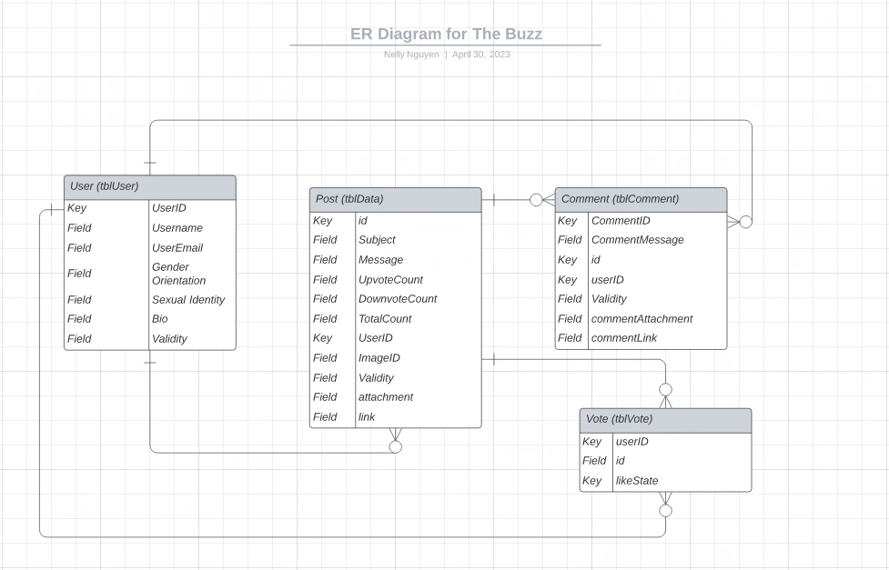

# README.md for Phase 3

## Updated User Stories for the Admin and Authenticated User

## **Updates to Admin User Stories**  
### User Story 13
1. As an **admin user**
2. I want to **be able to invalidate and validate users' posts**
3. So I can **control any outdated or inappropriate posts being uploaded by users**
**Test**: Manual -- Go into the admin-cli app, find a user profile, post, or comment that I want to either validate or invalidate and do so on my end.
### User Story 14
1. As an **admin user**
2. I want to **be able to view all documents, their original ownsers, and the recent activity on said documents**
3. So I can **remove any content that hasn't recently been accessed**
**Test**: Manual - Go into the admin-cli app, find a user's profile, post, or comment and check its recent activity on said post.

## **Updates to Authenticated User User Stories** 

### User Story 1
1. As a **user/employee (web visitor)**
2. I want to **add a message to my company's website**
3. So I can **communicate my ideas to other employees**
**Test**: Manual -- Anon. User clicks the add message button and fills out the relevant fields and pushes the post button to add a message to the website.

### User Story 2
1. As a **user/employee (web visitor)**
2. I want to **be able to see all the previous messages that was posted**
3. So I can **see all ideas published to the company's website**
**Test**: Manual -- Anon. User scrolls and is able to see all the previous messages through a Get call.

### User Story 3
1. As a **user/employee (web visitor)**
2. I want to **like a message that myself or another employee added to the website**
3. So I can **communicate to other employees that I like their ideas**
**Test**: Manual -- Anon. User likes a previous message and checks to see if the count increases.

### User Story 4
1. As a **user/employee (mobile app visitor)**
2. I want to **add a message to my company's mobile app**
3. So I can **communicate my ideas to other employees**
**Test**: Manual -- Anon. User clicks the add message button and fills out the relevant fields and pushes the post button to add a message to the app.

### User Story 5
1. As a **user/employee (mobile app visitor)**
2. I want to **be able to see all the previous messages that was posted**
3. So I can **see all ideas published to the company's mobile app**
**Test**: Manual -- Anon. User scrolls and is able to see all the previous messages through a Get call.

### User Story 6
1. As a **user/employee (mobile app visitor)**
2. I want to **like a message that myself or another employee added to the mobile app**
3. So I can **communicate to other employees that I like their ideas**
**Test**: Manual -- Anon. User likes a previous message and checks to see if the count increases.

### User Story 7
1. As a **user/employee (mobile app visitor)**
2. I want to **add an image to my company's mobile app**
3. So I can **communicate my ideas and graphics to other employees**
**Test**: Manual -- Anon. User clicks the add image button and fills out the relevant fields and pushes the post button to add a image to the app.

### User Story 8
1. As a **user/employee (mobile app visitor)**
2. I want to **add a url to my company's mobile app**
3. So I can **communicate my ideas and resources to other employees**
**Test**: Manual -- Anon. User clicks the add url button and fills out the relevant fields and pushes the post button to add a image to the app.

### User Story 9
1. As a **user/employee (mobile app visitor)**
2. I want to **click a posted url link on the mobile app**
3. So I can **see my employees and other users helpful resources**
**Test**: Manual -- Anon. User clicks url on a post and is directed to the url address

## Updated User Story-Based Tests (manual vs. automated)  

### **Updates to Admin Automated Tests**   
1. Test for ValidateUser() for validating a user
2. Test for InvalidateUser() for invalidating a user
3. Test for ValidatePost() for validating a post
4. Test for InvalidatePost() for invalidating a post
5. Test for viewLastAccess() for viewing the last time someone accessed a post, comment, or profile.

## **Frontend Updated Manual Tests**   
### User Story Test 1
**Test**: Manual -- Anon. User clicks the add message button and fills out the relevant fields and pushes the post button to add a message to the website.

### User Story Test 2
**Test**: Manual -- Anon. User scrolls and is able to see all the previous messages through a Get call.

### User Story Test 3
**Test**: Manual -- Anon. User likes a previous message and checks to see if the count increases. 

### User Story Test 4
**Test**: Manual -- Anon. User clicks the add message button and fills out the relevant fields and pushes the post button to add a message to the app.

### User Story Test 5
**Test**: Manual -- Anon. User scrolls and is able to see all the previous messages through a Get call.

### User Story Test 6
**Test**: Manual -- Anon. User likes a previous message and checks to see if the count increases. 

### User Story Test 7
**Test**: Manual -- Anon. User clicks the add image button and fills out the relevant fields and pushes the post button to add a image to the app.

### User Story Test 8
**Test**: Manual -- Anon. User clicks the add url button and fills out the relevant fields and pushes the post button to add a image to the app.

### User Story Test 9
**Test**: Manual -- Anon. User clicks url on a post and is directed to the url address

## System Drawing  

  

## Updated Mock Web UI Drawings  

## Updated state machine drawing for user persona’s interaction with the application  

  

## NEW state machine drawing from perspective of an idea object  

## Updated Listing of Routes, their Purpose, and Format of Passed Objects.  

## Updated Entity Relationship Diagram of the Database Tables and Fields.  

## Updated Unit Test DESCRIPTIONS for All Roles  
### **Backend Unit Test Descriptions**  
1. GET Image:
	https://2023sp-phase1-6.dokku.cse.lehigh.edu/image/imageID/sessionKey
	Uses the route image to know exactly which function to use.
	Passes in the imageID to know which image to return.
	Passes in the sessionKey since it is necessary for all routes due to new OAuth.
	
	Returned in the JSON should be txt in which the frontend can change to binary to use to display the image.

2. POST Image:
	https://2023sp-phase1-6.dokku.cse.lehigh.edu/image/sessionKey
	Uses the route image to know exactly which function to use.
	Don’t need an ID to post an image, as the image will automatically be created for the image.
	Passes in the sessionKey since it is necessary for all routes due to new OAuth.
	
	Not sure exactly where/what it does.
	Does it go to Google Drive (what google drive exactly?) – Then does it go to Memcachier if it is frequently visited?

3. GET Link:
	https://2023sp-phase1-6.dokku.cse.lehigh.edu/link/linkID/sessionKey
	Uses the route link to know exactly which function to use.
	Pass in the linkID to know which link to return.
	Passes in the sessionKey since it is necessary for all routes due to new OAuth.
	
	Returned in the JSON should be txt (??) in which the frontend can change to the correct format to use as a functional link.

4. POST Link:
	https://2023sp-phase1-6.dokku.cse.lehigh.edu/link/sessionKey
	Uses the route link to know exactly which function to use.
	Don’t need an ID to post a link , as the link will automatically be created for the link.
	Passes in the sessionKey since it is necessary for all routes due to new OAuth.

### **Admin Unit Test Descriptions**
1. Test for ValidateUser() for validating a user
2. Test for InvalidateUser() for invalidating a user
3. Test for ValidatePost() for validating a post
4. Test for InvalidatePost() for invalidating a post
5. Test for viewLastAccess() for viewing the last time someone accessed a post, comment, or profile.

### **Frontend Test Descriptions**   
1. Test if a web visitor can use their google account on the login page to login or create their account for "The Buzz"  
2. Test if a  first time web visitor with no account will be taken to the account creation page where they can input their account information.  
3. Test if a user can click on the "home page" or "user profile" buttons from the navigation bar to navigate to their respective pages.  
4. Test if a  user can cick on the downvote button to "dislike" a post and causing its "like" number to drop by 1.  
5. Test if a  user can click the comment button and taken to a new page to create a comment for the post they chose to comment on.  
6. Test if a  user can click on their own comments' edit button. This will take them to a different page where they can re-enter their comment.  
7. Test if a user can see all ideas, messages, and comments on the main page.  
8. Test if a user would click on another user's ID and be transported to that User's profile page.
9. Manual -- Anon. User clicks the add image button and fills out the relevant fields and pushes the post button to add a image to the app.
10. Manual -- Anon. User clicks the add url button and fills out the relevant fields and pushes the post button to add a image to the app.
11. Manual -- Anon. User clicks url on a post and is directed to the url address

## Backlog Items and Tech Debt  
1. Specific post and comments page: Show specific post
2. Specific post and comments page: Show comments on that specific post
3. Add a comment page: Add field to add comment
4. Profile: On main page, on each post, change ID to username (which if clicked, bring user to the profile of post author)
5. Profile: Page to show other users' profile