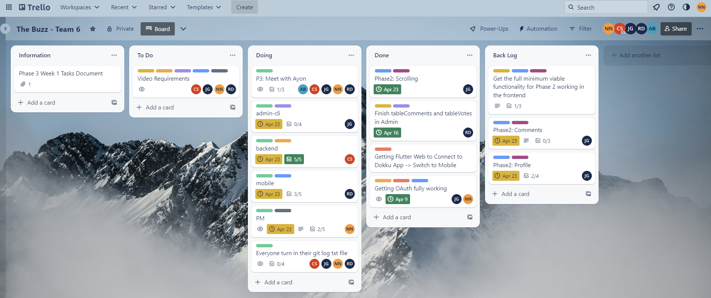

# Phase 3 Sprint 11
Use this form to provide your project manager report for Phase 3 Sprint 11.  Please give detailed answers.
In addition to uploading to coursesite, version control this in the `master` branch under the `docs` folder.

## Team Information [10 points]

Team Information:
* Number: 6  
* Name: Sixware Engineers  
* Mentor: <Ayon Bhowmick, ayb224@lehigh.edu>  

Team Roles:  
* Project Manger: <Nelly Nguyen, yen225@lehigh.edu>  
* Backend developer: <Carson Stotler, crs225@lehigh.edu>  
* Admin developer: <Jesus Gutierrez, jeg325@lehigh.edu>  
* Mobile developer: <Riley Dembo, rmd225@lehigh.edu>  

Essential links for this project:  
* Team's Dokku URL(s) (live web front-end link)  
    * http://2023sp-phase1-team6.dokku.cse.lehigh.edu  
* Team's software repo (bitbucket)  
    * https://bitbucket.org/cse216git/teamrepo/src/master/  
* Team's Trello board  
    * https://trello.com/invite/b/k6TDKKw5/ATTI58c7c8d8a99e2e8fc512cb422fdaf28fD008A87F/the-buzz-team-6   

## Backlog and Tech-debt [15 points total]

### Screenshot of Trello board [5 points]
 

### List of all backlog and tech debt items [10 points]
1. Specific post and comments page: Show specific post
2. Specific post and comments page: Show comments on that specific post
3. Add a comment page: Add field to add comment
4. Profile: On main page, on each post, change ID to username (which if clicked, bring user to the profile of post author)
5. Profile: Page to show other users' profile

## Role reporting [75 points total, 15 points each (teams of 4 get 15 free points)]
Report-out on each role, from the PM perspective.
You may seek input where appropriate, but this is primarily a PM related activity.

### Back-end

1. Describe the engagement of the developer with the team (communication with the team - use of Slack and Trello, attendance and participation in meetings, etc.)
* The backend developer was present at all team meetings, helpful in brainstorming the design for this phase. Carson started researching the different ways to implement Google Drive storage to the app. Carson was communicative and responsive on all channels (Slack, updating his progress on Trello, group chat, phone calls when necessary).
2. Assess the effort given by the developer in understanding the required changes and their impact on the code they are responsible for in this phase
* 5/5. Carson put in a lot of efforts to understand the code he inherited and to understand caching and google drive implementation. Asked questions during team meetings to fully understand the concept to implement them correctly. Communicative with the team about what he needs to be succesful this phase. Finished all tasks in a timely mannner and uploaded artifacts to drive. 
3. Did the developer review the Phase 2 version of the code with the person who last owned it?
* Yes. I (Nelly -- current PM) was backend last phase and I met with Carson about twice last week for us to go over backend code from Phase 2. We also spent time discussing how to implement Phase 3 functionalities given the state of Phase 2 code. 

### Admin

1. Describe the engagement of the developer with the team (communication with the team - use of Slack and Trello, attendance and participation in meetings, etc.)
* Jesus was absent this week but he communicated about his absence to the team and professor. Jesus was communicative and responsive on all channels (Slack, Trello, group chat). Jesus also met with our mentor to work on backlog items. 
2. Assess the effort given by the developer in understanding the required changes and their impact on the code they are responsible for in this phase
* The admin developer was present to all team meetings and contributed his inputs in the designs of this phase. He took notes of what was asked of him to make appropriate changes. 
3. Did the developer review the Phase 2 version of the code with the person who last owned it?
* During our team meetings, Riley and Jesus met to discuss Phase 2 code and asked each other any questions they might have had about each other's part from the last phase. 

### Mobile

1. Describe the engagement of the developer with the team (communication with the team - use of Slack and Trello, attendance and participation in meetings, etc.)
* Riley was present to all team meetings and in class. Riley was communicative and responsive all on channels (Slack, Trello, group chat), whether it was group discussions or one-on-one's. Riley was also proactive as she reported her progress throughout the week. 
2. Assess the effort given by the developer in understanding the required changes and their impact on the code they are responsible for in this phase
* Riley spent time understanding phase 2 code and outlining the required functionalities asked of her this phase. Riley also finished her parts in a timely manner and uploaded all artifacts to the shared drive. 
3. Did the developer review the Phase 2 version of the code with the person who last owned it?
* During our team meetings, Riley and Jesus met to discuss Phase 2 code and asked each other any questions they might have had about each other's part from the last phase. 

### Project Management
Self-evaluation of PM performance

1. When did your team meet with your mentor, and for how long?
* We met on 04/22 around 11:30AM for about 30-45 minutes. 
2. Describe your use of Trello.  Did you have too much detail?  Too little?  Just enough? Did you implement policies around its use (if so, what were they?)?
* Personally, I like to break down big tasks into smaller chunks as I believe people work better when presented with smaller, doable tasks. For each role, I added checklists (in which I broke down tasks into smaller chunks). I plan to add checklists (steps to implement their required components) for the incoming phases to the same card so developers can track their progress. 
3. How did you conduct team meetings?  How did your team interact outside of these meetings?
* We were very active on Slack. We had 2 team meetings which were in-person. Outside of meetings, our team was very communicative as we slacked, texted, or even called to discuss our parts, ask any questions we might have. 
4. What techniques (daily check-ins/scrums, team programming, timelines, Trello use, group design exercises) did you use to mitigate risk?
* We used check-ins on Slack, and informal check-ins in our group chat. Trello would be updated accordingly after each check-ins. We also set a timeline to make sure we stay on track. 
5. Describe any difficulties you faced in managing the interactions among your teammates? Were there any team issues that arose?
* I realized the importance of facilitation of communication as certain risk-mitigation strategies were not employed appropriately. Once realized that, I was more active and engage on ensuring the developers follow the risk-mitigation strategies. 
6. How well did you estimate time during the early part of the phase?  How did your time estimates change as the phase progressed?
* We set a timeline for the group but as some members reported that they were not able to stay on track with the timeline, we adjusted our timeline accordingly.
7. What aspects of the project would cause concern for your customer right now, if any?
* The mobile backlog. Comments and other users' profile. 
8. What is your biggest concern as you think ahead to the next phase of the project?
* Mobile backlog from last phase might have to be taken on by the current mobile developer. 
9. Describe the most significant obstacle or difficulty your team faced.
* Progress on backlog is somewhat slow and the cuurrent mobile developer might have to take on the backlog for the team to stay on track. I'm communicating with both developers to ensure a smooth transition.