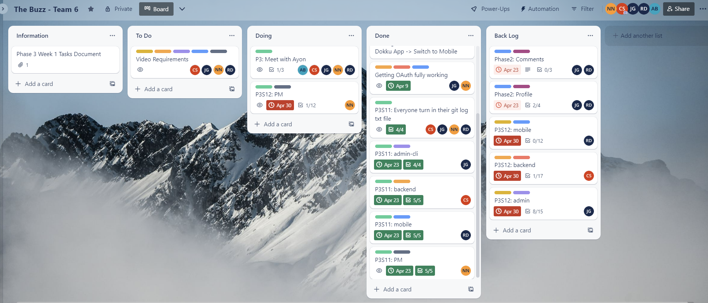

# Phase 3 Sprint 12 - PM Report Template
Use this form to provide your project manager report for Phase 3 Sprint 12.  Please give detailed answers.
In addition to uploading to coursesite, version control this in the `master` branch under the `docs` folder.

## Team Information [15 points]

Team Information:
* Number: 6  
* Name: Sixware Engineers  
* Mentor: <Ayon Bhowmick, ayb224@lehigh.edu>  

Team Roles:  
* Project Manger: <Nelly Nguyen, yen225@lehigh.edu>  
* Backend developer: <Carson Stotler, crs225@lehigh.edu>  
* Admin developer: <Jesus Gutierrez, jeg325@lehigh.edu>  
* Mobile developer: <Riley Dembo, rmd225@lehigh.edu>  

Essential links for this project:  
* Team's Dokku URL(s) (live web front-end link)  
    * https://2023sp-phase1-team6.dokku.cse.lehigh.edu  
* Team's software repo (bitbucket)  
    * https://bitbucket.org/cse216git/teamrepo/src/master/  
* Team's Trello board  
    * https://trello.com/invite/b/k6TDKKw5/ATTI58c7c8d8a99e2e8fc512cb422fdaf28fD008A87F/the-buzz-team-6   

## Backlog [10 points total, 5 points each]

### Screenshot of Trello board at beginning of sprint:
 

### Screenshot of Trello board at end of sprint:
(should match/support list of backlog and tech debt items in subheadings below)
 

## Role reporting [75 points total, 15 points each (teams of 4 get 15 free points)]
Report-out on each role, from the PM perspective.
You may seek input where appropriate, but this is primarily a PM related activity.

### Back-end

1. Describe the engagement of this component's developer with the team (How effective was the process? How was communication with the team - use of Slack and Trello, attendance and participation in meetings, etc. How were tasks created? How was completion of tasks verified?)
* Present at all team meetings, communicative on all channels of communication (slack, group chat, meetings). PM and backend discuss the tasks, PM breaks down the tasks on Trello Board, backend communicates his progress as he goes. Attended multiple OHs this week to figure out the GoogleAPI (potentially Dokku) issue. Andrew, Tony, Sunny, Ayon tried their best to help but couldn't figure it out. 
2. Assess the completeness of this component (list remaining backlog item(s), if any)
* All functionalities implemented but not yet tested because of GoogleAPI issue.
3. List your back-end's REST API endpoints
* /messages, /comments, /likes, /dislikes, /profile, /login, /logout
4. Assess the quality of the back-end code
* Manual code review: code looks good/makes sense but again, haven't been able to test because of GoogleAPI (which might be connected to the Dokku issue -- Dokku is related to the clientID that we're using on Google Cloud console)
5. Describe the code review process you employed for the back-end
* Daily check in, review code as backend makes progress, at the end of the sprint, backend shows postman tests of all routes. 
6. What was the biggest issue that came up in code review of the back-end server?
* Unable to conduct Postman test due to GoogleAPI (which might be connected to the Dokku issue -- Dokku is related to the clientID that we're using on Google Cloud console)
7. Is the back-end code appropriately organized into files / classes / packages?
* Yes, correct package, classes 
8. Are the dependencies in the pom.xml file appropriate? Were there any unexpected dependencies added to the program?
* All dependencies are appropriate and correspond with the code. 
9. Evaluate the quantity and quality of the unit tests for the back-end
* Unable to conduct Postman test due to GoogleAPI (which might be connected to the Dokku issue -- Dokku is related to the clientID that we're using on Google Cloud console)
10. Describe any technical debt you see in the back-end, if any
* Testing implemented routes. 

### Admin

1. Describe the engagement of this component's developer with the team (How effective was the process? How was communication with the team - use of Slack and Trello, attendance and participation in meetings, etc. How were tasks created? How was completion of tasks verified?)
* Admin developer was absent to team meeting without prior notice. Admin developer was communicated and helpful when asked. But does not report progress and progress is not as planned, promised. But he is working on his part and is partially complete. Admin did not go to OH.
2. Assess the completeness of this component (list remaining backlog item(s), if any)
* ERD updated to reflect database structure. Need to do: invalidate idea through admin-cli, list contents, remove uploaded content, invalidate files and links included with ideas and comments, unit tests
3. Describe the tables created by the admin app
* Tables are reflected in the ERD
4. Assess the quality of the admin code
* Not much progress, code not functional. 
5. Describe the code review process you employed for the admin app
* Check-in twice a week, some progress was made. However, not as planned. 
6. What was the biggest issue that came up in code review of the admin app?
* Progress not as promised from last check-in. Will implement a new code review strategy. 
7. Is the admin app code appropriately organized into files / classes / packages?
* Yes
8. Are the dependencies in the pom.xml file appropriate? Were there any unexpected dependencies added to the program?
* Did not need to add any additional packages that require dependencies. 
9. Evaluate the quantity and quality of the unit tests for the admin app
* Unit test for validation function -- unit test is functional. 
10. Describe any technical debt you see in the admin app, if any
* Linking the validation/invalidation across user, post, and comment. 

### Mobile

1. Describe the engagement of this component's developer with the team (How effective was the process? How was communication with the team - use of Slack and Trello, attendance and participation in meetings, etc. How were tasks created? How was completion of tasks verified?)
* Present at all team meetings, communicative on all channels of communication (slack, group chat, meetings). PM and mobile discuss the tasks, PM breaks down the tasks on Trello Board, mobile communicates her progress as she goes. Attended multiple OHs this week to figure out the GoogleAPI (potentially Dokku) issue. Andrew, Tony, Sunny, Ayon tried their best to help but couldn't figure it out. 
2. Assess the completeness of this component (list remaining backlog item(s), if any)
* Once we figure out the invalid token returned by GoogleAPI issue -- related to OAuth (which was functional last phase), we will start working on the 2 items from phase2 backlog and implement phase 3 functionalities. Hopefully, professor will be able to help us on Tuesday. 
3. Describe the activities that comprise the Mobile app
* As of last sprint, we were on track to implement functionalities. However, due to the new issue with the ID token and GoogleAPI, we were not able to start implementing the functionalities. 
4. Assess the quality of the Mobile code
* As I mentioned, Mobile was not able to start working on new functionalities and backlog items due to ID token issue (GoogleAPI, potentially Dokku issues). But she has been working on pseudo code so we can implement the functionalities quickly this upcoming sprint. 
5. Describe the code review process you employed for the Mobile front-end
* Check-in twice a week. We also attended OHs together (mobile, backend, PM) to figure out the ID token issue mentioned above. 
6. What was the biggest issue that came up in code review of the Mobile front-end?
* As I mentioned, Mobile was not able to start working on new functionalities and backlog items due to ID token issue (GoogleAPI, potentially Dokku issues). But she has been working on pseudo code so we can implement the functionalities quickly this upcoming sprint. We also attended OHs together (mobile, backend, PM) to figure out the ID token issue mentioned above. 
7. Is the Mobile front-end code appropriately organized into files / classes / packages?
* Yes
8. Are the dependencies in the pubspec.yaml (or build.gradle) file appropriate? Were there any unexpected dependencies added to the program?
* Yes
9. Evaluate the quantity and quality of the unit tests for the Mobile front-end here
* No new additional unit tests due to the ID token issue mentioned above.
10. Describe any technical debt you see in the Mobile front-end, if any
* The 2 phase2 backlog items, phase3 functionalities (more specific on trello board).

### Project Management
Self-evaluation of PM performance

1. When did your team meet with your mentor, and for how long?
* Friday 11:35 for almost an hour. 
2. Describe your use of Trello.  Did you have too much detail?  Too little?  Just enough? Did you implement policies around its use (if so, what were they?)?
* PM breaks down tasks and deliverables. Developers go on it and check off the checklist as they go. 
3. How did you conduct team meetings?  How did your team interact outside of these meetings?
* In-person, we report progress and talk about any issues that they wanted to bring up to the whole group. Outside of meetings, we are very active in group chat and slack. 
4. What techniques (daily check-ins/scrums, team programming, timelines, Trello use, group design exercises) did you use to mitigate risk?
* OHs together, daily/every 2 days checkin, team programming with some developers who need addtional support, detailed task on Trello. 
5. Describe any difficulties you faced in managing the interactions among your teammates? Were there any team issues that arose?
* Some members were not delivering the results promised. We will implement a stricter checkin and code review daily/every 2 days and PM will require developers to go to OHs (frequency depends on progress).
6. How well did you estimate time during the early part of the phase?  How did your time estimates change as the phase progressed?
* Underestimated the time and check-ins are not strict enough.
7. What aspects of the project would cause concern for your customer right now, if any?
* ID token issue -- which messes up all the functionalities that were working earlier due to the OAuth verification aspect implemented in all routes. 
8. What is your biggest concern as you think ahead to the project's close? What should be done to prepare the project for archive or transition to an entirely new team?
* Biggest concern is members' progress and make sure they deliver. We will be working daily this week to implement all functionalities. 
9. Describe the most significant obstacle or difficulty your team faced.
* ID token issues. Many TAs couldn't figure it out. We spent hours outside of class time, meetings, and OHs trying to figure it out as well.