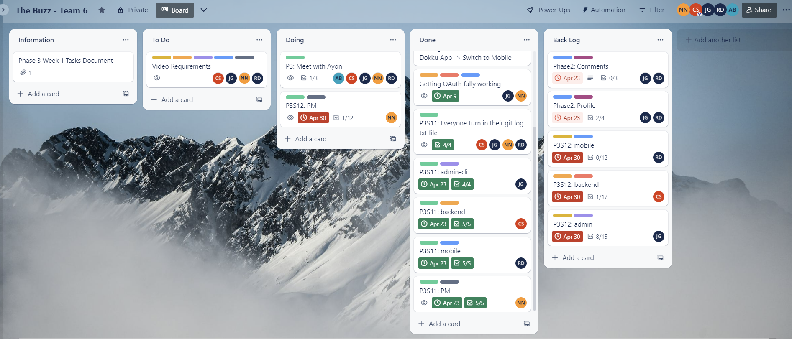
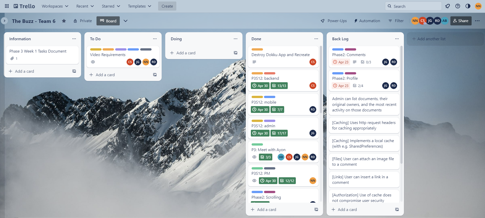

# Phase 3' Sprint 13 - PM Report Template
Use this form to provide your project manager report for Phase 3' (Prime).  Please give detailed answers.
In addition to uploading to coursesite, version control this in the `master` branch under the `docs` folder.

## Team Information [10 points]

Team Information:
* Number: 6  
* Name: Sixware Engineers  
* Mentor: <Ayon Bhowmick, ayb224@lehigh.edu>  

Team Roles:  
* Project Manger: <Nelly Nguyen, yen225@lehigh.edu>  
* Backend developer: <Carson Stotler, crs225@lehigh.edu>  
* Admin developer: <Jesus Gutierrez, jeg325@lehigh.edu>  
* Mobile developer: <Riley Dembo, rmd225@lehigh.edu>  

Essential links for this project:  
* Team's Dokku URL(s) (live web front-end link)  
    * https://2023sp-phase1-team6.dokku.cse.lehigh.edu  
* Team's software repo (bitbucket)  
    * https://bitbucket.org/cse216git/teamrepo/src/master/  
* Team's Trello board  
    * https://trello.com/invite/b/k6TDKKw5/ATTI58c7c8d8a99e2e8fc512cb422fdaf28fD008A87F/the-buzz-team-6   

## Beginning of Phase 3' [20 points]
Report out on the Phase 3 backlog and any technical debt accrued during Phase 3.

1. What required Phase 3 functionality was not implemented and why? 
    * This should be a list of items from the Phase 3 backlog that were not "checked off".
        * P2: Comments
        * P2: Profile
        * User can insert a link in an idea
        * User can insert a link in a comment
        * User can click a link retrieved with an idea or comment
        * User can use local storage and the camera and gallery API to take/access pictures
        * User can attach an image file to an idea
        * User can attach an image file to comment
        * User can retrieve and view a file previously updated and attached
        * Backend: caching
        * Backend: google drive API, google service account storage
        * Admin: validation function
        * Admin: list all documents and their owners
    * These high-priority items are to be added to the Phase 3' backlog that appears on your Trello board.

        * FE: Insert link/image to post
        * FE: Display link/image
        * FE: Display correct like count
        * BE: Caching for session key
        * BE: Google service account storage
        * Admin: Validation on admin-cli
2. What technical debt did the team accrue during Phase 3?
    * List this based on a unit-by-unit basis, as appropriate. It should summarize what appears in the role-reporting section, which may include further details.
    
        * Insert/display link/image in comment
        * Validation functionalities on admin-cli
        * Caching for session management
    * These items are to be added to the Phase 3' backlog that appears on your Trello board. 
        
        * Have already been added

Screenshot of Trello board (at the beginning of Phase 3'):
(should match/support list of backlog and tech debt items)
 

## End of Phase 3' [20 points]
Report out on the Phase 3' backlog.

1. What required Phase 3 functionality still has not been implemented or is not operating properly and why?
    * Caching is not fully implemented due to time constraint
    * Comments (from phase 2 -- however, professor has said we don't have to worry about phase 2 backlog and just focus on phase 3 functionalities)
    * Profile (from phase 2 -- however, professor has said we don't have to worry about phase 2 backlog and just focus on phase 3 functionalities)

2. What technical debt remains?
    * Fully implement caching

Screenshot of Trello board (at the close of Phase 3'):
(should match/support list of backlog and tech debt items)
 

## Role reporting [50 points total, 10 points each (teams of 4 get 10 free points)]
Report-out on each team members' activity, from the PM perspective (you may seek input where appropriate, but this is primarily a PM related activity).

1. If there was any remaining Phase 3 functionality that needed to be implemented in Phase 3', what did the PM do to assist in the effort of getting this functionality implemented and operating properly?

    * Pair programming
    * Research ways to implement certain functionalities for each of the developers
    * Break down the tasks into smaller, doable tasks to assist developer understand the steps they have to take
    * Go to OHs with the developers to provide another perspective, in terms of debugging
    * Help identify potential edits to fix any functionalities that are not working as intended
    * Set up meetings every 2 days to work together so we can work through any issues that arise
    * Helped all of the developers troubleshoot issues

### Back-end

1. What did the back-end developer do during Phase 3'?
    * Went to many OHs, pair programmed with PM, seeked out help from mentors, TAs, and even the professor to resolve Dokku issue. Once the Dokku issue was resolved, pair programmed with PM, checked in with PM to consistently to make sure he was on the right track. Was succesful in implementing Google Drive API and caching for session management.
2. Describe the engagement of this component's developer with the team (How effective was the process? How was communication with the team - use of Slack and Trello, attendance and participation in meetings, etc. How were tasks created? How was completion of tasks verified?)
    * Present at all team meetings, communicative on all channels of communication (slack, group chat, meetings). PM and backend discuss the tasks, PM breaks down the tasks on Trello Board, backend communicates his progress as he goes and asks for clarification whenever something is not clear. PM and Backend also met one on one whenever we thought of a fix to an ongoing issue to just tackle that issue and move on to the next item -- developer always prioritized the project. 
3. Assess the completeness of this component (list remaining backlog item(s), if any)
    * In terms of functionalities, google drive storage (service account) was implemented and is functional, caching (for session management) code was written, login (to account for banned users) was modified. 
4. List your back-end's REST API endpoints
    * /messages, /comments, /likes, /dislikes, /profile, /login, /logout
5. Assess the quality of the back-end code
    * Backend code is reliable and maintanable as comments were added as he programmed. 
6. Describe the code review process you employed for the back-end
    * During code review, PM asks questions about new changes and Backend developer has to explain the change and show all subsequent changes. Backend also runs tests in front of PM. 
7. What was the biggest issue that came up in code review of the back-end server?
    * Unexpected errors or errors that the developer might have missed. We then debug together to resolve the errors. 
8. Is the back-end code appropriately organized into files / classes / packages?
    * Yes
9. Are the dependencies in the pom.xml file appropriate? Were there any unexpected dependencies added to the program?
    * Yes they are appropriate, and no unnecessary dependencies
10. Evaluate the quantity and quality of the unit tests for the back-end
    * All routes were tested and passed. 
11. Describe any technical debt you see in the back-end, if any
    * N/A

### Admin

1. What did the admin front-end developer do during Phase 3'?
    * Met with teams multiple times. Seeked help from TAs to implement all his required functionalities. Provided assistance with mobile as he was mobile last phase. 
2. Describe the engagement of this component's developer with the team (How effective was the process? How was communication with the team - use of Slack and Trello, attendance and participation in meetings, etc. How were tasks created? How was completion of tasks verified?)
    * Present at all team meetings, communicative on all channels of communication (slack, group chat, meetings). PM and admin discuss the tasks, PM breaks down the tasks on Trello Board, PM checks in occasionally and developer communicates his progress and asks for clarification whenever something is not clear. Assisted current mobile developer. The developer put in significant effort this sprint. 
3. Assess the completeness of this component (list remaining backlog item(s), if any)
    * Complete
4. Describe the tables created by the admin app
    * Tables are created as designed in the ERD. 
5. Assess the quality of the admin code
    * Reliable and maintable code
6. Describe the code review process you employed for the admin app
    * PM and Admin walk through his code. PM asks questions and Admin explains code and show any related changes. 
7. What was the biggest issue that came up in code review of the admin app?
    * Unit tests passed but code did not function as expected. We had to give the unit tests a second look. 
8. Is the admin app code appropriately organized into files / classes / packages?
    * Yes, they are appropriately organized into files/ classes/ packages. 
9. Are the dependencies in the pom.xml file appropriate? Were there any unexpected dependencies added to the program?
    * Dependencies are as expected, no unnecessary dependencies. 
10. Evaluate the quantity and quality of the unit tests for the admin app
    * Good
11. Describe any technical debt you see in the admin app, if any
    * N/A

### Mobile

1. What did the mobile front-end developer do during Phase 3'?
    * Attended many OHs, met with professor, met with mentor to resolve the id token issue. Worked extra hard to work on backlog from Phase 2' as well as implementing Phase 2 functionalities. 
2. Describe the engagement of this component's developer with the team (How effective was the process? How was communication with the team - use of Slack and Trello, attendance and participation in meetings, etc. How were tasks created? How was completion of tasks verified?)
    * Present at all team meetings, communicative on all channels of communication (slack, group chat, meetings). PM and mobile discuss the tasks, PM breaks down the tasks on Trello Board, mobile communicates her progress as she goes and asks for clarification whenever something is not clear. She put in a lot of efforts to complete the tasks and always prioritized the project. 
3. Assess the completeness of this component (list remaining backlog item(s), if any)
    * Comments are not fully implemented, however, professor said that phase2 backlogs are not required and will be extra credits if implemnted as we experienced a Dokku issue (that required professor's assistance as TAs were not able to help figure it out). Which is why we haven't been able to do much last sprint. On that note, mobile was able to implement posting and receiving/displaying links and images. Mobile was also able to fix the like count issue from last phase. 
4. Describe the activities that comprise the Mobile app
    * Posting a link to an idea. Posting an image to an idea. Likes function as expected. Profile page and editing profile page functions as expected. 
5. Assess the quality of the Mobile code
    * Maintainable and reliable code as she organizes code into different files based on functionalities, along with commenting as she programs. 
6. Describe the code review process you employed for the Mobile front-end
    * PM and Mobile discuss the changes. PM asks questions (using the rubric as a guideline), mobile goes over the code that reflects the functionality in question and explain any related changes. We also work through any issues that Mobile might have had. 
7. What was the biggest issue that came up in code review of the Mobile front-end?
    * PM is not familiar with Flutter, specifically Dart so explaination took some time. However, with the help of current Admin developer whenever asked of him, the code review process went smoothly. 
8. Is the Mobile front-end code appropriately organized into files / classes / packages?
    * Yes
9. Are the dependencies in the pubspec.yaml (or build.gradle) file appropriate? Were there any unexpected dependencies added to the program?
    * Dependencies are as expected, there are no unneccesary dependencies. 
10. Evaluate the quantity and quality of the unit tests for the Mobile front-end here
    * Mobile has high quality manual unit tests to test current functionalities. 
12. Describe any technical debt you see in the Mobile front-end, if any
    * Other users' profile
    * Link and image on comments

### Project Management
Self-evaluation of PM performance

1. When did your team meet with your mentor, and for how long?
    * We met on Friday at 10:30, the meeting lasted 30 minutes and we communicated on Slack whenever we needed help after that as we stayed as a group to further work on the project. 
2. Describe how the team worked together in Phase 3'. Were all members engaged? Was the work started early in the week or was there significant procrastination?
    * All members started early and put in significant efforts this phase as we had to catch up on Phase 2 backlogs, as well as Phase 3 functionalities that we haven't been able to work on due to the Dokku issue. Everyone was engaged and involved in troubleshooting process. 
3. Describe your use of Trello.  Did you have too much detail?  Too little?  Just enough? Did you implement policies around its use (if so, what were they?)?
    * Trello tasks are just right. I added a checklist with even more specified tasks for members that might need it. During code review (which happens twice or thrice a week), PM breaks down tasks and gets updates on progress.
4. How did you conduct team meetings?  How did your team interact outside of these meetings?
    * Team meetings were all in person. Outside of meetings, we used slack, groupchat to communicate. A lot of communications happened this week. 
5. What techniques (daily check-ins/scrums, team programming, timelines, Trello use, group design exercises) did you use to mitigate risk?
    * Informal daily check-in through text. Code review every 2 days. Pair programming whenever neccesary. 
6. Describe any difficulties you faced in managing the interactions among your teammates? Were there any team issues that arose?
    * No issue this sprint. Everyone was fully committed to get the project done. 
7. How well did you estimate time during the early part of the phase?  How did your time estimates change as the phase progressed?
    * Again, we underestimated the time as issues kept coming up and we lost hours to debugging rather than working on the next functionalities. 
8. What aspects of the project would cause concern for your customer right now, if any?
    * Comments functionality is missing (however, due to Dokku issue -- we weren't able to work on this and the professor said we don't have to worry about backlog from Phase 2). Seeing other users' profile is also missing (but this is also from Phase 2). Due to the time constraints, caching is not fully implemented (BE has code for caching but not yet implemented or test, caching not implemnted on FE).
9. Describe any concerns you may have about the prospects for success moving forward? What steps can the team take to reduce your concern?
    * Backlog items are building up. If given more time, we are confident we can fully implement all the missing functionalities. 
10. Describe the most significant obstacle or difficulty your team faced.
    * Time constraint as we had to work on all phase 3 functionalities in 1 week (as we lost the other sprint to the Dokku issue). 